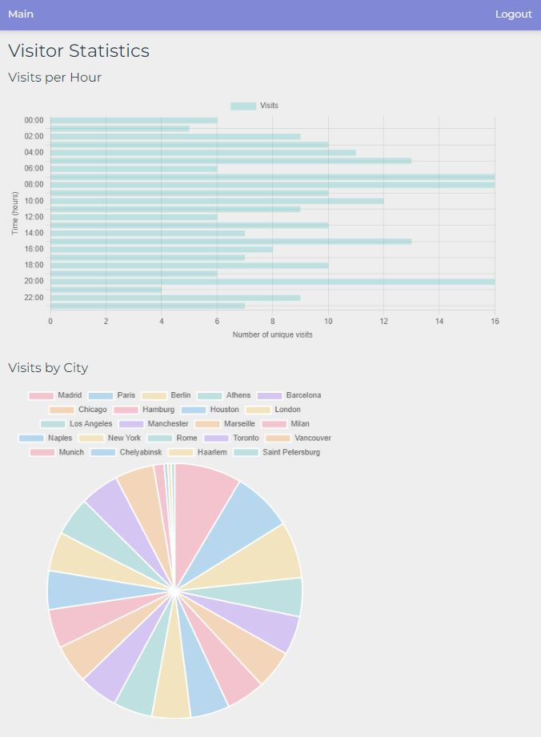

## Описание

Счетчик посещений страницы. Компоненты

- скрипт в файле script.js подключается к любому сайту, собирает данные (ip, город, устройство) и отправляет их на сервер

- сервер получает данные (файл track.php), сохраняет их в БД и показывает графики посещений: по часам (по оси х - количество уникальных посещений за час, по оси y- время) и круговую диаграмму с разбиением по городам

### Live demo

На [этом](http://84.38.180.229:124) сайте ведется статистика посещений  

Статистику можно посмотреть [здесь](http://84.38.180.229:125)  

Учетные данные

email: `admin`  
password: 1

После посещения сайта, на котором ведется статистика, ваш город появится на круговой диаграмме
 
 

